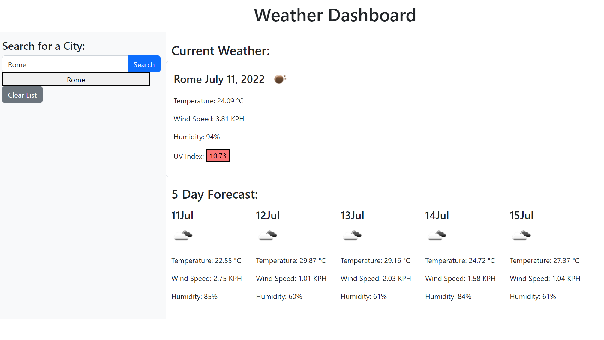

# weather-dashboard
Server API challenge 6

# User Story
* AS A traveler
* I WANT to see the weather outlook for multiple cities
* SO THAT I can plan a trip accordingly

# Acceptance Critera 
* GIVEN a weather dashboard with form inputs
* WHEN I search for a city
* THEN I am presented with current and future conditions for that city and that city is added to the search history
* WHEN I view current weather conditions for that city
* THEN I am presented with the city name, the date, an icon representation of weather conditions, the temperature, the humidity, the wind speed, and the UV index
* WHEN I view the UV index
* THEN I am presented with a color that indicates whether the conditions are favorable, moderate, or severe
* WHEN I view future weather conditions for that city
* THEN I am presented with a 5-day forecast that displays the date, an icon representation of weather conditions, the temperature, the wind speed, and the humidity
* WHEN I click on a city in the search history
* THEN I am again presented with current and future conditions for that city

# Overview
* User can search a city
* They will be given the current forecast as well as a 5 day forecast
* Searched cities will be pinned to side bar and can be clicked on to go back to view that city's weather
* On page refresh, the last city searched will load up

# Deployed URL
https://itsgeebee.github.io/weather-dashboard/

# Dashboard look

